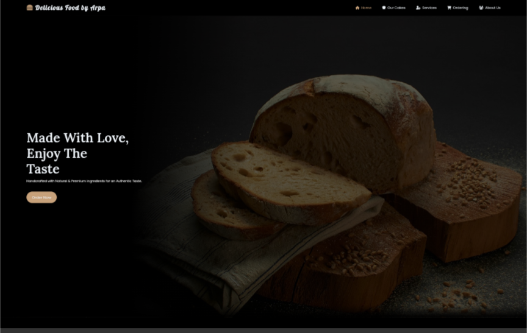

<p align="center">
  
</p>

# 🎂 Delicious Food by Arpa

> A custom cake ordering website built for a Chittagong-based bakery brand.

**Delicious Food by Arpa** is a personalized cake business that lets customers place custom cake orders via WhatsApp. The website is fully responsive, user-friendly, and built with **HTML, CSS, and JavaScript** — no backend needed!

---

## 🌐 Live Website

👉 [Visit the site on GitHub Pages](https://atikulislamx.github.io/Delicious-Food-By-Arpa/)

---

## 📸 Demo Preview



---

## 🚀 Features

- 📱 WhatsApp-based ordering system  
- 🧁 Custom cake categories & filtering  
- 💰 Real-time price list with images  
- ❓ Interactive FAQ section  
- 🕒 Business hours and delivery info  
- 📦 Fast delivery (Chittagong City only)

---

## 💼 Client Info

- **Business Name:** Delicious Food by Arpa  
- **Location:** Chittagong, Bangladesh  
- **Specialty:** Custom-designed cakes  
- **Delivery Area:** Chittagong City only  
- **Advance Payment:** ❌ Not required  
- **WhatsApp Contact:** [+8801648630785](https://wa.me/8801648630785)

---

## 🛠️ Built With

- ✅ HTML5  
- ✅ CSS3  
- ✅ JavaScript  
- ✅ Bootstrap 5  
- ✅ Font Awesome  
- 🚀 GitHub Pages for deployment

---

## 📜 License

This project is licensed under the [Creative Commons Attribution-NonCommercial 4.0 International License](https://creativecommons.org/licenses/by-nc/4.0/).

© 2025 Atikul Islam Rabbi. All rights reserved.

---

## 📂 How to Run Locally

```bash
git clone https://github.com/Atikulislamx/Delicious-Food-By-Arpa.git
cd Delicious-Food-By-Arpa
open index.html
